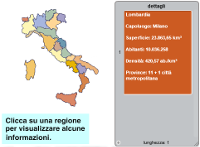
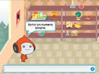

# {{ page.title }}

Per rendere i progetti più adatti all'ambiente scolastico, soprattutto a partire dalla scuola primaria di secondo grado in su, si è pensato di utilizzare un approccio "multidisciplinare", ovvero affrontare tramite il computer un argomento che non sia un gioco o l'informatica stessa, bensì un'altra materia del curriculum scolastico.

In questa sezione verranno aggiunti i progetti che, seguendo questo approccio, possono fornire agli insegnanti del materiale utile per l'introduzione del computer come strumento a corredo dell'insegnamento di varie materie e non più fine a se stesso.

Anche perché ho notato che se ai ragazzi non si riesce a comunicare quali possono essere gli usi pratici di una macchina, passato l'entusiasmo iniziale, dopo aver realizzato qualche giochino, perdono rapidamente interesse nell'attività di programmazione proprio perché appare fine a se stessa.

## Geografia

| Regioni italiane | [Scarica ZIP](files/regioni_italiane.zip) |
| --- | --- |
|  | [Vai all'anteprima](https://scratch.mit.edu/projects/237549863/){:target="_blank"} |

Si tratta di creare una cartina geografica dell'Italia suddivisa per regioni. Cliccando su ciascuna regione si visualizzano alcune informazioni come il capoluogo, la superficie, ecc. Il tutorial può essere realizzato a vari livelli di complessità a seconda dell'età degli studenti, per esempio utilizzando la grafica già inclusa, oppure facendo realizzare a loro le immagini delle regioni o arricchendo a piacimento la parte che illustra i dettagli di ogni regione.

## Matematica

| Conversione binario decimale | [Scarica ZIP](files/conversione_binario_decimale.zip) |
| --- | --- |
|  | [Vai all'anteprima](https://scratch.mit.edu/projects/238642233/){:target="_blank"} |

Lo scopo è quello di sviluppare un programma che chiede l'inserimento di un numero binario e lo converte nella corrispondente rappresentazione decimale.
