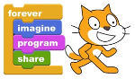
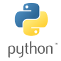

# {{ page.title }}

I tutorial sono stati suddivisi per linguaggio di programmazione o piattaforma di sviluppo. Questi sono al momento a disposizione:

| :---: | :---: |
|  | [Scratch](scratch) |
|  |  [HTML/CSS/Javascript](web) |
|  | [Python](python) |
