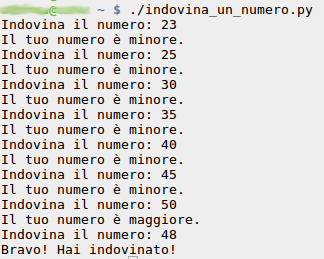

# {{ page.title }}

Da questa pagina potete scaricare i tutorial per Python.

| Indovina un numero | [Scarica ZIP](files/python_indovina_un_numero.zip) |
| :--- | --- |
|  | &nbsp; |

Il programma estrae un numero a caso tra 1 e 50 e chiede al giocatore di indovinarlo. Per ogni tentativo inserito il programma indica se il numero è troppo alto o troppo basso, oppure se il giocatore ha indovinato.

| Indovina un numero con interfaccia grafica composta usando Kivy | [Scarica ZIP](files/python_indovina_un_numero_gui.zip) |
| :--- | --- |
| Questa versione ha un'interfaccia grafica creata con [Kivy](http://www.kivy.org){:target="_blank"}. | &nbsp; |

Il programma estrae un numero a caso tra 1 e 50 e chiede al giocatore di indovinarlo. Per ogni tentativo inserito il programma indica se il numero è troppo alto o troppo basso, oppure se il giocatore ha indovinato.

L'uso di un framework grafico come Kivy è un modo per avvicinare un ragazzo per la prima volta alla programmazione a oggetti; difatti il tutorial contiene una prima introduzione alla terminologia legata agli oggetti (classi, ecc.).
