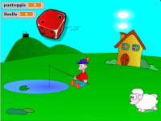
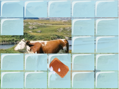
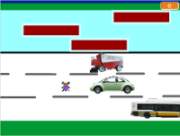
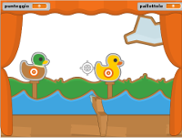
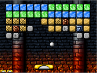

Da questa pagina potete scaricare i tutorial per Scratch.

| Caduta dadi | [Scarica ZIP](files/caduta_dadi.zip) |
| --- | --- |
|  | [Vai all'anteprima](https://scratch.mit.edu/projects/58624412/){:target="_blank"} |

Il gioco consiste nel premere il tasto corrispondente al numero che compare sulla faccia del dado che sta cadendo prima che questo tocchi terra. Se si preme il tasto giusto il punteggio aumenta di uno.

| Scopri immagini | [Scarica ZIP](files/scopri_immagini.zip) |
| --- | --- |
|  | [Vai all'anteprima](https://scratch.mit.edu/projects/49248044/){:target="_blank"} |

L'obiettivo del gioco è quello di passare una spugna sopra le “piastrelle” che nascondono un'immagine per scoprire di che immagine si tratta.
Si può anche estendere il gioco facendo in modo, una volta scoperta completamente un'immagine, di passare a un'immagine successiva, e così via fino a quando si vuole.

| Scarafaggio | [Scarica ZIP](files/scarafaggio.zip) |
| --- | --- |
|  | &nbsp; |

Il povero scarafaggio deve superare una serie di pericoli per poter tornare a casa. Con i tasti frecce si possono controllare i suoi movimenti.

| Tiro a segno | [Scarica ZIP](files/tiro_a_segno.zip) |
| --- | --- |
|  | [Vai all'anteprima](https://scratch.mit.edu/projects/98004013/){:target="_blank"} |

Lo scopo del gioco è quello del tiro a segno che si trovava nei luna park nelle feste di paese: devi cercare di colpire i bersagli mobili con un fucile che muovi tramite il mouse.

| Arkanoid | [Scarica ZIP](files/arkanoid.zip) |
| --- | --- |
|  | [Vai all'anteprima](https://scratch.mit.edu/projects/88495350/){:target="_blank"} |

Questo è un tutorial particolare, perché non contiene la descrizione di come sviluppare tutto il gioco: difatti è destinato a "utenti" un po' più esperti.
Nel tutorial viene descritta la parte più complicata, ovvero come si possono modificare e aggiungere i livelli del gioco e come si fa a creare dei blocchi personalizzati.
