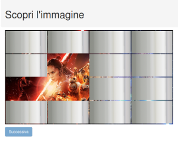

# {{ page.title}}

Da questa pagina potete scaricare i tutorial per HTML/CSS/Javascript, insomma le tecnologie utilizzate sul Web.

| Scopri immagine | [Scarica ZIP](files/web_scopri_immagine.zip) |
| --- | --- |
|  | &nbsp; |

C'è un'immagine nascosta da una serie di "piastrelle": ogni piastrella scompare se ci si clicca sopra rivelando parte dell'immagine. Quando l'immagine è completamente scoperta si attiva il pulsante "Successiva" per passare all'immagine successiva.
Il gioco funziona completamente all'interno di un browser.
